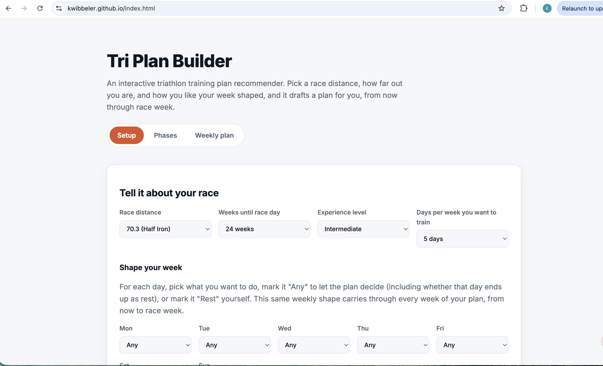

# Decision log
---

## 1. What did you set out to build, and what changed?

What you wanted at the start, and what is actually live now.
Name one thing you dropped or added along the way, and why.

I set out to build a triathlon training website and scheduling tool. The idea was that someone could input the amount of weeks they had before their desired race day, skill level, and how many days a week they were willing to train, and then the site will give them a weekly workout schedule in order to meet the race goal. Something that I added during the development was originally I was not going to have any local storage, however I realized that to effectively have multiple pages based on the same info (derived from the user inputs) that using local js storage was the best route. The live site now has a setup page, a phases page and a weekly phase. 

---

## 2. A fork in the road

Name one real choice where you could have gone two ways.
Plain HTML or a framework. One page or several. Your own CSS or someone's template.
What goes on the front page and what does not.

Say which you picked, what the alternative was, and what you gave up by not taking it.

"There was no alternative" is not an answer. Find the fork.

One design choice where I could have gone two ways was deciding how many pages to have. Initially I wanted the whole site to just be a single page because I thought that would be the most concise, however once I made the first draft of the site I realized that one page was way too cluttered. So instead, I decided to have a front page where all of the user inputs are accepted, a phases page that chunks out the weeks leading up to the race, and then a weekly page that has the most details on the training. On the weekly page, there are workouts for each day of the week the user wanted to train, so they know how long and what type of training for that certain day. The trade off of using multiple pages was that I had to find a way to manage the site data since it had to be retained across pages. The plan now lives only in one browser's localStorage, and visiting weekly.html without setting up first has no plan to show. The other tradeoff was that the user interface was not as simple or as clean and I had oringinally desired but there was too much content for one page. 

---

## 3. Where you overruled the agent

One time Claude suggested, wrote, or claimed something and you did not take it.

What did it do? How did you notice? What did you do instead?

If it genuinely never happened, say so plainly, and then say what you would have had to
check in order to notice. Being honest here costs you far less than a story you cannot
defend when you record your video. 

One example when I overruled Claude was in the logic of how the "Shape your week" dropdowns were handled. Claude asked me if the day grid should replace the days-per-week menu or work with it, and I said they should work together to confirm each other. It built that as a validation that checked the number of non-rest days on the grid against the days-per-week dropdown before it would generate a plan, but it counted "Any" as a workout day. I didn't catch it from Claude's summary because it just described the check as a live match between the grid and the dropdown, which sounded right. I noticed when I previewed the site and tried the case I expected to work, 5 days a week with every day left on "Any," and instead of a plan I got an error saying 7 days on the grid were set to a workout. I didn't accept that logic. I told Claude that "Any" should mean "let the tool decide," so if someone picks 5 days a week and doesn't specify their rest days, the tool should pick them itself and not produce an error. Claude agreed it was a bug and changed it so validation only flags real conflicts, and a new step turns just enough "Any" days into rest days to hit the days-per-week target, spread out evenly across the week so they aren't bunched together.

---

## 4. How you know it works

What check did you run, and what did it tell you?

Then the real question: **what would have made this check fail?**
A check that could not have failed is not a check.

Link to your `verification/` folder.

I ran this check on the live site: GET https://kwibbeler.github.io/.
The response showed: 
status: 200
content-type: text/html; charset=utf-8
bytes: 3484 
And the site itself showed: 

The check told me that the site was running and behaving as intended. 

This check could have failed if Pages was still in the middle of deploying. During development this did happen once because the first fetch right after pushing returned a 404 for phases.html, when Pages was still deploying the new commit and was serving the old template. I waited and refetched, and it returned 200. 

Evidence: [verification/](verification/)

---

## 5. What is still wrong

One thing on your own site that is not right, not finished, or that you do not
fully understand.

What would you do next, and how would you find out?

One thing that is not quite right in my mind is that there should be a way for a user to create a login/profile so their training plan can be saved and accessed across multiple devices. This could be solved by adding a backend database to support the site since GitHub pages only serves static files and the localStorage I am using now only stays in one browser. Another thing I would like to fix in the future is that once a user has selected all the inputs and a training plan has been generated, I would like the home/default page to be the phases or weekly page rather then always going back to the setup page since it is not as useful to be on that page when you already have a plan. 
